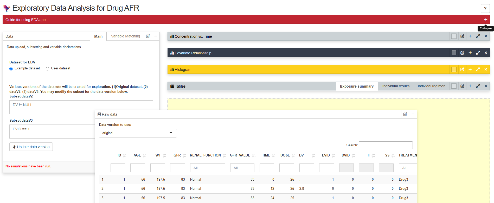

# Standard PK Exploratory Data Analysis Template [Shiny]

## Uncompleted project. This is ongoing so use with caution for now.
## Version 1 completion: Mid December




__Sample deployed template__: https://pharmacometric.shinyapps.io/pharmacometric-shiny-eda-template/

Creating a standard R script for a Shiny dashboard to perform exploratory data analysis (EDA) on clinical study data is an essential step in the data analysis pipeline. This dashboard can provide interactive visualizations and summary statistics that allow researchers to explore the data's underlying patterns, distributions, and relationships among variables. By incorporating various tools such as scatter plots, histograms, and box plots, users can gain insights into the data at a granular level. The flexibility of Shiny enables real-time updates, allowing users to filter and manipulate data dynamically, which is particularly useful for identifying trends and anomalies before proceeding to more complex modeling.

The importance of using clean data free of outliers cannot be overstated in the context of pharmacometric model development. Outliers can significantly distort statistical analyses and lead to inaccurate model predictions, potentially compromising the validity of the study results. By ensuring that the data is thoroughly cleaned and pre-processed, researchers can improve the robustness of their models and enhance their ability to make reliable inferences about drug behavior in populations. Clean data facilitates better parameter estimation, reduces uncertainty in model predictions, and ultimately contributes to more effective decision-making in clinical settings. Therefore, conducting comprehensive EDA to identify and address potential data quality issues is a critical precursor to successful pharmacometric modeling.

### Usage 
```r

# Download and unzip the content of this repository
# Set working directory to the unzipped folder
setwd("pharmacometric-shiny-template-eda")

# Load shiny and run app
library(shiny)
runApp(launch.browser = 1L)

```


```
# Required libraries and versions

shiny, version 1.8.1.1
shinyjs, version 2.1.0
rhandsontable, version 0.3.8
DT, version 0.33
flextable, version 0.9.6
nlme, version 3.1.166
markdown, version 1.13
card.pro, version 2.2.1
dplyr, version 1.1.4
ggplot2, version 3.5.1
magrittr, version 2.0.3
mrgsolve, version 1.5.1
quickcode, version 1.0.3
patchwork, version 1.3.0
table1, version 1.4.3
r2resize, version 1.9.1
rlang, version 1.1.4
grid, version 4.4.1
ggthemes, version 5.1.0
```
### Features

The following features are available in the current template for you to get started.

 - __User customizable interface__. This means the user can move around the panels to desired locations on the screen. They may also change the title and color of the panels to suite their needs. 
 - __Panel location and features saved across sessions__. This means that after re-arrangement of panels, changing panel colors or titles, one may refresh the page and the settings are retained.
 - __Resizable Panels__. Panels are resizable to allow easy focus on specific contents, like plots or tables of result.

 - __Aesthetics for completion__. App title are formatted to look professional. A sample icon is also provided, which may be replaced when updating the template to suit your need.
 
 
 
### Issues

If you have issues or questions, create an 'issue' or contribute to one within the issue tab of this github repository


### Contributors

Contributors interact with the project on GitHub by filing new issues, improving existing issues, or submitting pull requests. Anyone can become a contributor, which means there is no expectation of commitment to the project, no required set of skills, and no selection process.
